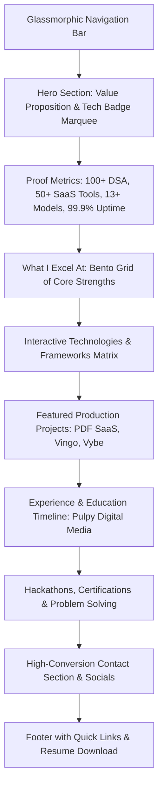

# 🚀 Razee Jafri - High-Performance Developer Portfolio
## Master Architectural & Design Plan

---

### 1. Executive Summary & Vision

This project is a bespoke, state-of-the-art developer portfolio engineered for **Razee Jafri**, a Full-Stack MERN & Next.js Developer. 

The portfolio blends the best design paradigms from two benchmark websites:
1. **[Rondeo Balos](https://rondeobalos.com/)**: Dark cyber-aesthetic, grid-matrix background, glowing neon badges, interactive project cards, developer illustration/mockup hero, and micro-animated tool badges.
2. **[Oak Harbor Web Designs](https://oakharborwebdesigns.com/)**: High-conversion typography, clean metric stat counters, realistic multi-device previews (Laptop & Mobile framing), card layout elegance, and high-trust proof points.

Every single data point in this portfolio strictly mirrors **Razee Jafri's verified resume and GitHub persona (`razeejafri`)**:
- **Experience**: Pulpy Digital Media OPC Pvt. Ltd. (Software Developer Intern)
- **Top Projects**:
  - **PDF SaaS** (Next.js 16, React 19, TypeScript, Docker, 50+ tools, client WebAssembly & microservices)
  - **Vingo** (Food Delivery Platform with Socket.io live tracking, Leaflet, Razorpay, Multi-role JWT)
  - **Vybe** (Social Media Platform with Gemini AI auto-captions, Socket.io real-time, Redux, Cloudinary)
- **Achievements & Certs**: Oracle Cloud 2025 AI Foundations, Adobe India Hackathon 2025, 100+ DSA Problems.
- **Education**: B.Tech in IT (2022-2026), GPA 7.5/10.00, Dr. Ambedkar Institute of Technology for Divyangjan.

---

### 2. Recommended Tech Stack

| Layer | Technology | Purpose / Justification |
|---|---|---|
| **Framework** | **React 19 + Vite** | Blazing fast build & HMR, modular component structure, zero latency. |
| **Styling** | **Tailwind CSS + Custom CSS Variables** | Modern HSL-based dark palette, glassmorphism utilities, glow rings, custom neon gradients. |
| **Icons** | **Lucide React** | Ultra-crisp, tree-shakable SVG icon set for developer tools and UI controls. |
| **Animations** | **Framer Motion + CSS Keyframes** | Scroll-triggered entrance reveals, smooth tab transitions, floating mockup animations. |
| **Performance** | **Vite Optimization + Code Splitting** | Targeting 98-100 Google Lighthouse score (Performance, SEO, Accessibility). |

---

### 3. Design System & Visual Identity

- **Color Palette**:
  - **Background Base**: `#06080F` (Deep Space Navy/Obsidian)
  - **Surface & Cards**: `#0F172A` / `rgba(15, 23, 42, 0.75)` with `backdrop-blur-md` and `1px solid rgba(255,255,255,0.08)`
  - **Primary Neon Accent**: `#38BDF8` (Electric Cyan) & `#6366F1` (Indigo Glow)
  - **Secondary Accent**: `#A855F7` (Vibrant Purple for AI/Next.js tags)
  - **Text Primary**: `#F8FAFC` (Pure High-Contrast White)
  - **Text Muted**: `#94A3B8` (Slate Gray)
- **Visual Features**:
  - Subtle grid dot/mesh matrix background pattern (inspired by Rondeo Balos).
  - Glassmorphic navigation bar with blurred backdrop and quick contact CTA.
  - Interactive device frames (Laptop + Mobile) displaying real project screenshot previews (inspired by Oak Harbor).
  - Glowing pill tags for technologies with hover elevation.

---

### 4. Page Architecture & Section Breakdown

#### Detailed Sections:
1. **Header & Navigation**:
   - Logo / Monogram `RJ.`
   - Smooth-scrolling anchors: `Projects`, `Skills`, `Experience`, `About`, `Contact`.
   - Action buttons: "Download CV" (direct resume trigger) and "Let's Talk".

2. **Hero Section (Fusion of Rondeo & Oak Harbor)**:
   - Status Indicator: `🟢 Available for Full-Stack Opportunities`
   - Bold Headline: *"Full-Stack Developer crafting resilient web architectures & real-time apps."*
   - Subheading with Razee's core identity: Specializing in Next.js 16, React 19, Node.js, and Docker-driven cloud deployments.
   - Dual Call-to-Actions: `[Explore Projects]` and `[Get in Touch]`.
   - Quick Social Links: GitHub (`razeejafri`), LinkedIn, Email (`jafrirazee@gmail.com`).
   - Visual Centerpiece: Interactive 3D/Glass laptop & phone mockup displaying code execution & UI preview.

3. **Metrics Bar (Oak Harbor Inspiration)**:
   - `50+` Production Utilities Engineered
   - `100+` DSA Problems Solved (LeetCode / GFG)
   - `3+` Full-Scale Architectures Shipped
   - `100%` Modern Responsive & Containerized Ready

4. **"What I Excel At" (Rondeo Balos Bento Cards)**:
   - **Full-Stack Architecture**: Monorepos, Next.js App Router, Microservices, REST APIs.
   - **Real-Time & Distributed Systems**: Socket.io live tracking, Leaflet Geo-mapping, Redis caching.
   - **Cloud, DevOps & Security**: Docker containerization, JWT multi-role RBAC, Razorpay payments, CI/CD.
   - **AI Integrations**: Google Gemini API, automated AI workflows, client-side WebAssembly.

5. **Technical Skills Matrix**:
   - Filterable / categorized tabs: *All*, *Languages*, *Frontend*, *Backend*, *Databases*, *DevOps & Tools*.
   - Interactive badge cards with icons for JavaScript, TypeScript, Python, React, Next.js, Node.js, MongoDB, PostgreSQL, Redis, Docker, Git, etc.

6. **Featured Projects Showcase**:
   - **Project 1: PDF SaaS Suite**
     - Next.js 16, React 19, TypeScript, Docker, Tesseract OCR, Wasm.
     - Live demo badge & GitHub repository link.
     - Key engineering highlights (Client-side privacy processing, zero persistent storage, Dockerized engine).
   - **Project 2: Vingo - Food Delivery Platform**
     - React 19, Express.js, MongoDB, Socket.io, Leaflet, Razorpay.
     - Multi-role RBAC (Customer, Store, Delivery), real-time live geolocation & ETA.
   - **Project 3: Vybe - AI-Powered Social Platform**
     - React, Redux, Express, MongoDB, Gemini API, Cloudinary.
     - AI auto-caption generation, real-time feeds and story reels.

7. **Work Experience & Engineering Journey**:
   - **Pulpy Digital Media OPC Pvt. Ltd.** (Software Developer Intern, May 2026 – Present)
     - Production Git workflow, peer reviews, scalable backend microservices, caching and performance tuning.
   - **Dr. Ambedkar Institute of Technology for Divyangjan** (B.Tech IT, 2022 – 2026, GPA 7.5/10.00).

8. **Certifications & Milestones**:
   - Oracle Cloud Infrastructure 2025 Certified AI Foundations Associate.
   - Adobe India Hackathon 2025 (Round 1 Competitor).
   - 100+ Competitive Programming & DSA solutions.

9. **Contact & Footer Section**:
   - Modern floating card with direct contact details: `jafrirazee@gmail.com`, `+91-8739926740`, Kanpur, India.
   - Interactive "Copy Email" button with instant toast notification.
   - Clean contact form with client-side validation.
   - Footer with copyright, back-to-top button, and GitHub live status indicator.

---

### 5. Implementation Stages

1. **Stage 1 (Scaffolding)**: Initialize Vite + React + Tailwind CSS project with optimal configs.
2. **Stage 2 (Design Tokens & Assets)**: Setup custom fonts (Inter/Outfit), neon glow utilities, and project data JSON.
3. **Stage 3 (Core Components)**: Implement Navbar, Hero, Metrics, Bento Cards, Projects, Timeline, and Contact.
4. **Stage 4 (Interactivity & Polish)**: Add smooth scrolling, copy-to-clipboard, filter transitions, and responsive mobile drawer.
5. **Stage 5 (Verification & Lighthouse Audit)**: Validate zero build errors, optimal responsive viewports, and accurate GitHub links.
